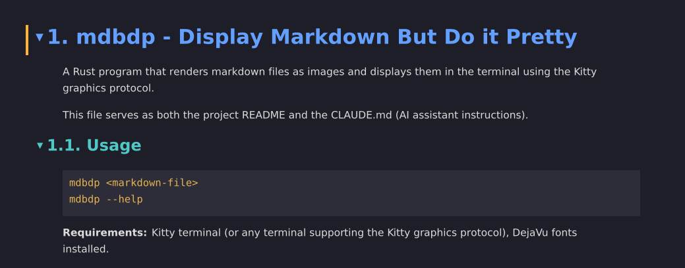

# dmbdip - Display Markdown But Do it Pretty



A Rust program that renders markdown files as images and displays them in the terminal using the Kitty graphics protocol. Includes basic file navigation utilities.

## Usage

```
dmbdip [markdown-file-or-directory]
dmbdip --help
```

When given a markdown file, opens it full-width with the file list hidden. Press Left to reveal the file list and browse sibling files. When given a directory (or no argument), opens the file browser with a file list on the left and markdown preview on the right.

**Requirements:** Kitty terminal (or any terminal supporting the Kitty graphics protocol), DejaVu fonts installed.

## Installation

### Pre-built binaries

Download pre-built binaries for Linux (x86_64) and macOS (x86_64, Apple Silicon) from the [GitHub Releases](https://github.com/sapristi/dmbdip/releases) page.

On macOS, you'll need DejaVu fonts installed:

```
brew install font-dejavu
```

### Building from source

Requires Rust (1.85+ for edition 2024). Install via [rustup](https://rustup.rs/).

```
cargo build --release
```

The binary will be at `target/release/dmbdip`. Copy it to a directory in your `$PATH`:

```
cp target/release/dmbdip ~/.local/bin/
```

## Keybindings

### Document View

| Key | Action |
|-----|--------|
| Up/Down | Navigate between headings |
| Tab | Toggle fold open/close |
| Right | Hide file list (full-width reading) |
| Left | Show file list / back to browser |
| Space | Scroll down |
| Ctrl+Space | Scroll up |
| j/k | Small scroll steps |
| PgUp/PgDn | Half-page scroll |
| Home/End | Jump to top/bottom |
| / | Search text (vim-style) |
| n/N | Next/previous search match |
| h | Show keybindings help overlay |
| q/Esc/Ctrl-C | Quit |

### File Browser

| Key | Action |
|-----|--------|
| Up/Down, j/k | Move cursor |
| Right/Enter | Open file / enter subfolder |
| Left | Go to parent directory |
| h | Show help |
| q/Esc/Ctrl-C | Quit |

## Development

See [DEVELOPMENT.md](DEVELOPMENT.md) for architecture, tech stack, task tracking, and workflow notes.
