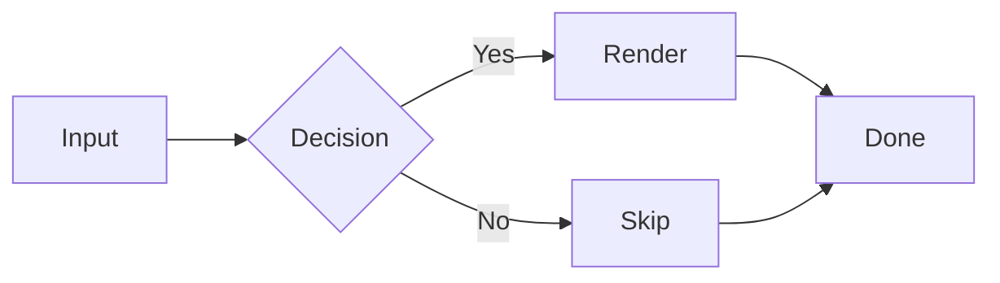

# Mermaid Diagram Rendering Implementation Plan

> **For agentic workers:** REQUIRED SUB-SKILL: Use superpowers:subagent-driven-development (recommended) or superpowers:executing-plans to implement this plan task-by-task. Steps use checkbox (`- [ ]`) syntax for tracking.

**Goal:** Render fenced ` ```mermaid ` and ` ```mmd ` code blocks as rasterized diagrams inside the markdown view, with auto dark/light theming, in-memory caching, and graceful error images.

**Architecture:** Parser recognizes mermaid language tags and emits a new `Block::Mermaid { source }` variant. A new `src/mermaid.rs` module owns an LRU-less in-memory `MermaidCache` keyed by `(source hash, target width, dark flag)`. The renderer threads `&mut MermaidCache` through the three render passes and composites cached `Arc<RgbImage>` diagrams into the main page image. No browser; no Node; `mermaid-rs-renderer` produces SVG, `usvg`/`resvg` rasterize to memory.

**Tech Stack:** Rust 2024, `pulldown-cmark` 0.13, `image` 0.25, `mermaid-rs-renderer` 0.2, `usvg` 0.46, `resvg` 0.46.

**Key paths (read before starting):**
- Spec: `docs/superpowers/specs/2026-04-17-mermaid-rendering-design.md`
- Block enum: `src/types.rs`
- Parser: `src/parsing.rs`
- Renderer: `src/render.rs`
- App state: `src/state.rs`
- File-watcher reload / browser integration: `src/browser.rs`

**Testing conventions in this codebase:**
- Tests colocate in `#[cfg(test)] mod tests { ... }` at the bottom of each source file.
- `src/test_helpers.rs` provides `test_fonts()`, `SAMPLE_MD`, `SAMPLE_WITH_META`.
- Run a single test: `cargo test --lib tests::<name>` or `cargo test <substring>`.
- Run all tests: `cargo test`.

---

## Task 1: Detect mermaid code blocks in the parser

**Files:**
- Modify: `src/types.rs` — add `Block::Mermaid` variant
- Modify: `src/parsing.rs` — capture fence language, dispatch on it
- Modify: `src/render.rs` — no-op match arms (temporary; replaced in Task 6)
- Modify: `src/state.rs` — no-op match arms (temporary; replaced in Task 6)

### Steps

- [ ] **Step 1: Add failing test for mermaid language detection**

Append inside `#[cfg(test)] mod tests` in `src/parsing.rs`:

```rust
#[test]
fn parse_mermaid_block_by_language_tag() {
    let md = "```mermaid\nflowchart LR; A-->B\n```\n";
    let (blocks, _) = parse_markdown(md);
    assert_eq!(blocks.len(), 1);
    assert!(matches!(&blocks[0], Block::Mermaid { source } if source.contains("flowchart LR")));
}

#[test]
fn parse_mmd_alias_becomes_mermaid_block() {
    let md = "```mmd\nflowchart TD; X-->Y\n```\n";
    let (blocks, _) = parse_markdown(md);
    assert!(matches!(&blocks[0], Block::Mermaid { .. }));
}

#[test]
fn parse_non_mermaid_fence_stays_code_block() {
    let md = "```rust\nfn main() {}\n```\n";
    let (blocks, _) = parse_markdown(md);
    assert!(matches!(&blocks[0], Block::CodeBlock { .. }));
}

#[test]
fn parse_mermaid_lang_is_case_insensitive() {
    let md = "```MERMAID\nflowchart LR; A-->B\n```\n";
    let (blocks, _) = parse_markdown(md);
    assert!(matches!(&blocks[0], Block::Mermaid { .. }));
}

#[test]
fn parse_mermaid_lang_ignores_trailing_attrs() {
    let md = "```mermaid title=foo\nflowchart LR; A-->B\n```\n";
    let (blocks, _) = parse_markdown(md);
    assert!(matches!(&blocks[0], Block::Mermaid { .. }));
}
```

- [ ] **Step 2: Run tests, confirm they fail with a compile error**

Run: `cargo test --lib parse_mermaid 2>&1 | head -40`
Expected: compile error about `Block::Mermaid` not existing.

- [ ] **Step 3: Add the `Mermaid` variant**

In `src/types.rs`, inside `pub(crate) enum Block { ... }`, add a variant (place it after `List`):

```rust
    Mermaid {
        source: String,
    },
```

- [ ] **Step 4: Capture fence info and dispatch**

In `src/parsing.rs`:

1. Update the import line at the top from:

```rust
use pulldown_cmark::{Event as MdEvent, Options, Parser, Tag, TagEnd};
```

to:

```rust
use pulldown_cmark::{CodeBlockKind, Event as MdEvent, Options, Parser, Tag, TagEnd};
```

2. Inside `parse_markdown`, next to the other `let mut in_code_block = false; ...` lines (around line 75), add:

```rust
    let mut code_lang: Option<String> = None;
```

3. Replace the `MdEvent::Start(Tag::CodeBlock(_))` arm with:

```rust
            MdEvent::Start(Tag::CodeBlock(kind)) => {
                in_code_block = true;
                code_text.clear();
                code_lang = match &kind {
                    CodeBlockKind::Fenced(info) => Some(info.to_string()),
                    CodeBlockKind::Indented => None,
                };
                block_start_offset = range.start;
            }
```

4. Replace the `MdEvent::End(TagEnd::CodeBlock)` arm with:

```rust
            MdEvent::End(TagEnd::CodeBlock) => {
                in_code_block = false;
                let text = std::mem::take(&mut code_text);
                let lang = code_lang
                    .take()
                    .unwrap_or_default()
                    .split_whitespace()
                    .next()
                    .unwrap_or("")
                    .to_ascii_lowercase();
                let block = if lang == "mermaid" || lang == "mmd" {
                    Block::Mermaid { source: text }
                } else {
                    Block::CodeBlock { text }
                };
                blocks.push(block);
                block_source_lines.push(byte_to_line(source_offset + block_start_offset));
            }
```

- [ ] **Step 5: Add temporary no-op arms in `src/render.rs` to restore compile**

Add a `Block::Mermaid { .. } => {}` arm at the end of each of the three `match block { ... }` expressions inside:

1. `render_preview` (around line 37-104): add `Block::Mermaid { .. } => {}`
2. `render_markdown` (around line 140-219): add `Block::Mermaid { .. } => {}`
3. `compute_total_height` (around line 282-326): add `Block::Mermaid { .. } => {}`

For all three, the arm goes inside the `match block { ... }` braces, before the closing `}`. No effect on `y` or `h`.

- [ ] **Step 6: Add temporary no-op arms in `src/state.rs`**

1. In `block_contains_text` (around line 274), add:

```rust
        Block::Mermaid { source } => source.to_lowercase().contains(query),
```

2. In `compute_block_highlights` (around line 340), add:

```rust
        Block::Mermaid { .. } => {}
```

- [ ] **Step 7: Run tests, confirm they pass**

Run: `cargo test --lib parse_mermaid`
Expected: 5 passed.

- [ ] **Step 8: Run the full suite to confirm nothing regressed**

Run: `cargo test`
Expected: all pre-existing tests still pass; 5 new ones pass.

- [ ] **Step 9: Commit**

```bash
git add src/types.rs src/parsing.rs src/render.rs src/state.rs
git commit -m "feat(parser): detect mermaid/mmd fenced code blocks as Block::Mermaid"
```

---

## Task 2: Add dependencies and build mermaid module skeleton

**Files:**
- Modify: `Cargo.toml`
- Create: `src/mermaid.rs`
- Modify: `src/main.rs` — register the module

### Steps

- [ ] **Step 1: Add dependencies to `Cargo.toml`**

Under `[dependencies]` (append at the bottom):

```toml
mermaid-rs-renderer = { version = "0.2", default-features = false }
resvg = "0.46"
usvg = "0.46"
```

- [ ] **Step 2: Fetch and verify the dependencies compile**

Run: `cargo build 2>&1 | tail -20`
Expected: build succeeds (may be slow the first time — resvg/usvg pull in image/text deps).

- [ ] **Step 3: Create `src/mermaid.rs` with skeleton and module smoke test**

Create `src/mermaid.rs`:

```rust
use std::collections::HashMap;
use std::collections::hash_map::DefaultHasher;
use std::hash::{Hash, Hasher};
use std::sync::Arc;

use image::{Rgb, RgbImage};

#[derive(Hash, PartialEq, Eq, Clone, Copy)]
pub(crate) struct MermaidCacheKey {
    pub(crate) source_hash: u64,
    pub(crate) target_width: u32,
    pub(crate) dark: bool,
}

pub(crate) struct MermaidCache {
    entries: HashMap<MermaidCacheKey, Arc<RgbImage>>,
}

impl MermaidCache {
    pub(crate) fn new() -> Self {
        Self { entries: HashMap::new() }
    }

    #[allow(dead_code)]
    pub(crate) fn clear(&mut self) {
        self.entries.clear();
    }

    pub(crate) fn len(&self) -> usize {
        self.entries.len()
    }
}

pub(crate) fn is_dark_bg(bg: Rgb<u8>) -> bool {
    let [r, g, b] = bg.0;
    (r as u32 + g as u32 + b as u32) < 3 * 128
}

pub(crate) fn hash_source(source: &str) -> u64 {
    let mut h = DefaultHasher::new();
    source.hash(&mut h);
    h.finish()
}

#[cfg(test)]
mod tests {
    use super::*;

    #[test]
    fn cache_new_is_empty() {
        let cache = MermaidCache::new();
        assert_eq!(cache.len(), 0);
    }

    #[test]
    fn dark_bg_detection() {
        assert!(is_dark_bg(Rgb([0, 0, 0])));
        assert!(is_dark_bg(Rgb([30, 30, 30])));
        assert!(!is_dark_bg(Rgb([200, 200, 200])));
        assert!(!is_dark_bg(Rgb([255, 255, 255])));
    }

    #[test]
    fn hash_source_is_deterministic() {
        let a = hash_source("flowchart LR; A-->B");
        let b = hash_source("flowchart LR; A-->B");
        assert_eq!(a, b);
    }

    #[test]
    fn hash_source_differs_on_different_input() {
        let a = hash_source("flowchart LR; A-->B");
        let b = hash_source("flowchart LR; A-->C");
        assert_ne!(a, b);
    }
}
```

- [ ] **Step 4: Register the module**

In `src/main.rs`, find the other `mod ...;` declarations and add:

```rust
mod mermaid;
```

Keep modules in alphabetical order if that's already the convention.

- [ ] **Step 5: Run tests**

Run: `cargo test --lib mermaid::tests`
Expected: 4 passed.

- [ ] **Step 6: Commit**

```bash
git add Cargo.toml Cargo.lock src/mermaid.rs src/main.rs
git commit -m "feat(mermaid): add mermaid-rs-renderer + resvg deps and cache skeleton"
```

---

## Task 3: Mermaid SVG rendering helper

**Files:**
- Modify: `src/mermaid.rs`

### Steps

- [ ] **Step 1: Add failing tests for SVG rendering**

Append to `#[cfg(test)] mod tests` in `src/mermaid.rs`:

```rust
#[test]
fn render_svg_valid_diagram_returns_svg_string() {
    let result = render_mermaid_svg("flowchart LR\n    A --> B", false);
    assert!(result.is_ok(), "expected Ok, got: {:?}", result);
    let svg = result.unwrap();
    assert!(svg.contains("<svg"), "output should contain <svg tag");
}

#[test]
fn render_svg_dark_palette_affects_output() {
    let light = render_mermaid_svg("flowchart LR\n    A --> B", false).unwrap();
    let dark = render_mermaid_svg("flowchart LR\n    A --> B", true).unwrap();
    // Different theme palettes produce different SVG bytes.
    assert_ne!(light, dark, "dark and light SVGs should differ");
}

#[test]
fn render_svg_invalid_input_returns_err() {
    let result = render_mermaid_svg("this is not a mermaid diagram at all", false);
    assert!(result.is_err(), "expected Err for invalid input, got Ok");
}
```

- [ ] **Step 2: Run tests, confirm failure**

Run: `cargo test --lib mermaid::tests::render_svg 2>&1 | head -20`
Expected: compile error — `render_mermaid_svg` and `mermaid_theme_for` not defined.

- [ ] **Step 3: Add theme helper and SVG renderer**

Append to `src/mermaid.rs` (above the `#[cfg(test)] mod tests` block):

```rust
fn mermaid_theme_for(dark: bool) -> mermaid_rs_renderer::Theme {
    let mut t = mermaid_rs_renderer::Theme::modern();
    if dark {
        t.background = "#1e1e1e".to_string();
        t.primary_color = "#264f78".to_string();
        t.primary_text_color = "#d4d4d4".to_string();
        t.primary_border_color = "#569cd6".to_string();
        t.secondary_color = "#3c3c3c".to_string();
        t.tertiary_color = "#2d2d30".to_string();
        t.line_color = "#7f7f7f".to_string();
        t.text_color = "#d4d4d4".to_string();
        t.edge_label_background = "#1e1e1e".to_string();
        t.cluster_background = "#2d2d30".to_string();
        t.cluster_border = "#569cd6".to_string();
    }
    t
}

pub(crate) fn render_mermaid_svg(source: &str, dark: bool) -> Result<String, String> {
    let mut opts = mermaid_rs_renderer::RenderOptions::modern();
    opts.theme = mermaid_theme_for(dark);
    mermaid_rs_renderer::render_with_options(source, opts)
        .map_err(|e| e.to_string())
}
```

- [ ] **Step 4: Run tests, confirm they pass**

Run: `cargo test --lib mermaid::tests::render_svg`
Expected: 3 passed.

If `render_svg_invalid_input_returns_err` fails because bad input still returns Ok, adjust the test input to more obviously invalid syntax (e.g. the first word must not be a known diagram type):

```rust
let result = render_mermaid_svg("@@@ not a diagram @@@", false);
```

- [ ] **Step 5: Commit**

```bash
git add src/mermaid.rs
git commit -m "feat(mermaid): render source to SVG with theme auto dark/light"
```

---

## Task 4: SVG → RgbImage rasterization

**Files:**
- Modify: `src/mermaid.rs`

### Steps

- [ ] **Step 1: Add failing tests for rasterization**

Append to `#[cfg(test)] mod tests` in `src/mermaid.rs`:

```rust
const TINY_SVG: &str = r#"<svg xmlns="http://www.w3.org/2000/svg" width="100" height="50" viewBox="0 0 100 50"><rect width="100" height="50" fill="red"/></svg>"#;

#[test]
fn rasterize_small_svg_at_intrinsic_size() {
    let bg = Rgb([255, 255, 255]);
    let img = rasterize_svg_to_rgb(TINY_SVG, 800, bg).unwrap();
    assert_eq!(img.width(), 100);
    assert_eq!(img.height(), 50);
}

#[test]
fn rasterize_scales_down_when_wider_than_max() {
    let bg = Rgb([255, 255, 255]);
    let img = rasterize_svg_to_rgb(TINY_SVG, 50, bg).unwrap();
    assert_eq!(img.width(), 50);
    assert_eq!(img.height(), 25);
}

#[test]
fn rasterize_never_scales_up() {
    let bg = Rgb([255, 255, 255]);
    let img = rasterize_svg_to_rgb(TINY_SVG, 5000, bg).unwrap();
    // SVG is 100 wide; max_width 5000 should NOT enlarge it.
    assert_eq!(img.width(), 100);
    assert_eq!(img.height(), 50);
}

#[test]
fn rasterize_invalid_svg_returns_err() {
    let bg = Rgb([255, 255, 255]);
    let result = rasterize_svg_to_rgb("not-an-svg", 800, bg);
    assert!(result.is_err());
}
```

- [ ] **Step 2: Run tests, confirm failure**

Run: `cargo test --lib mermaid::tests::rasterize 2>&1 | head -20`
Expected: compile error — `rasterize_svg_to_rgb` not defined.

- [ ] **Step 3: Implement rasterization**

Append to `src/mermaid.rs` (above `#[cfg(test)]`):

```rust
pub(crate) fn rasterize_svg_to_rgb(
    svg: &str,
    max_width: u32,
    bg: Rgb<u8>,
) -> Result<RgbImage, String> {
    let mut opt = usvg::Options::default();
    opt.fontdb_mut().load_system_fonts();

    let tree = usvg::Tree::from_str(svg, &opt).map_err(|e| e.to_string())?;

    let size = tree.size();
    let intrinsic_w = size.width();
    let intrinsic_h = size.height();
    if intrinsic_w <= 0.0 || intrinsic_h <= 0.0 {
        return Err("SVG has zero intrinsic size".into());
    }

    let scale = if intrinsic_w > max_width as f32 {
        max_width as f32 / intrinsic_w
    } else {
        1.0
    };
    let out_w = (intrinsic_w * scale).round().max(1.0) as u32;
    let out_h = (intrinsic_h * scale).round().max(1.0) as u32;

    let mut pixmap = resvg::tiny_skia::Pixmap::new(out_w, out_h)
        .ok_or_else(|| "failed to allocate pixmap".to_string())?;
    pixmap.fill(resvg::tiny_skia::Color::from_rgba8(bg.0[0], bg.0[1], bg.0[2], 255));

    let transform = resvg::tiny_skia::Transform::from_scale(scale, scale);
    resvg::render(&tree, transform, &mut pixmap.as_mut());

    // Pixmap stores premultiplied RGBA8. Convert to RGB by compositing over bg.
    let mut img = RgbImage::new(out_w, out_h);
    for (i, px) in pixmap.pixels().iter().enumerate() {
        let x = (i as u32) % out_w;
        let y = (i as u32) / out_w;
        // Pixmap pixel values are premultiplied; demultiply by alpha to blend.
        let a = px.alpha();
        let (r, g, b) = if a == 0 {
            (bg.0[0], bg.0[1], bg.0[2])
        } else {
            let inv = 255.0 / a as f32;
            let pr = (px.red() as f32 * inv).round().clamp(0.0, 255.0) as u8;
            let pg = (px.green() as f32 * inv).round().clamp(0.0, 255.0) as u8;
            let pb = (px.blue() as f32 * inv).round().clamp(0.0, 255.0) as u8;
            let af = a as f32 / 255.0;
            let blend = |fg: u8, bk: u8| {
                (fg as f32 * af + bk as f32 * (1.0 - af)).round() as u8
            };
            (blend(pr, bg.0[0]), blend(pg, bg.0[1]), blend(pb, bg.0[2]))
        };
        img.put_pixel(x, y, Rgb([r, g, b]));
    }

    Ok(img)
}
```

- [ ] **Step 4: Run rasterization tests**

Run: `cargo test --lib mermaid::tests::rasterize`
Expected: 4 passed.

- [ ] **Step 5: Commit**

```bash
git add src/mermaid.rs
git commit -m "feat(mermaid): rasterize SVG to RgbImage with scale-to-fit"
```

---

## Task 5: Error image + `MermaidCache::get_or_render`

**Files:**
- Modify: `src/mermaid.rs`

### Steps

- [ ] **Step 1: Add failing tests for error rendering and caching**

Append to `#[cfg(test)] mod tests` in `src/mermaid.rs`. This requires `crate::fonts::Fonts` and `crate::theme::Theme` — use the existing test helpers:

```rust
use crate::test_helpers::test_fonts;
use crate::theme::default_theme;

#[test]
fn error_image_is_nonempty_and_respects_max_width() {
    let fonts = test_fonts();
    let theme = default_theme();
    let img = render_error_image("boom", 200, &fonts, &theme);
    assert!(img.width() > 0);
    assert!(img.height() > 0);
    assert!(img.width() <= 200);
}

#[test]
fn cache_hit_returns_pointer_equal_arc() {
    let fonts = test_fonts();
    let theme = default_theme();
    let mut cache = MermaidCache::new();
    let a = cache.get_or_render("flowchart LR\n    A --> B", 400, false, &fonts, &theme);
    let b = cache.get_or_render("flowchart LR\n    A --> B", 400, false, &fonts, &theme);
    assert!(Arc::ptr_eq(&a, &b), "second call must return cached Arc");
    assert_eq!(cache.len(), 1);
}

#[test]
fn cache_key_distinguishes_width() {
    let fonts = test_fonts();
    let theme = default_theme();
    let mut cache = MermaidCache::new();
    cache.get_or_render("flowchart LR\n    A --> B", 400, false, &fonts, &theme);
    cache.get_or_render("flowchart LR\n    A --> B", 600, false, &fonts, &theme);
    assert_eq!(cache.len(), 2);
}

#[test]
fn cache_key_distinguishes_dark_flag() {
    let fonts = test_fonts();
    let theme = default_theme();
    let mut cache = MermaidCache::new();
    cache.get_or_render("flowchart LR\n    A --> B", 400, false, &fonts, &theme);
    cache.get_or_render("flowchart LR\n    A --> B", 400, true, &fonts, &theme);
    assert_eq!(cache.len(), 2);
}

#[test]
fn invalid_source_yields_error_image_without_panic() {
    let fonts = test_fonts();
    let theme = default_theme();
    let mut cache = MermaidCache::new();
    // "@@@ bogus @@@" should fail to parse as a mermaid diagram.
    let img = cache.get_or_render("@@@ bogus @@@", 400, false, &fonts, &theme);
    assert!(img.width() > 0);
    assert!(img.height() > 0);
}

#[test]
fn clear_empties_the_cache() {
    let fonts = test_fonts();
    let theme = default_theme();
    let mut cache = MermaidCache::new();
    cache.get_or_render("flowchart LR\n    A --> B", 400, false, &fonts, &theme);
    assert_eq!(cache.len(), 1);
    cache.clear();
    assert_eq!(cache.len(), 0);
}
```

- [ ] **Step 2: Run tests, confirm failure**

Run: `cargo test --lib mermaid::tests 2>&1 | tail -20`
Expected: compile errors — `render_error_image` and `get_or_render` not defined.

- [ ] **Step 3: Implement error image**

At the **top** of `src/mermaid.rs`, add these imports alongside the existing ones:

```rust
use ab_glyph::PxScale;
use imageproc::drawing::{draw_text_mut, text_size};

use crate::fonts::Fonts;
use crate::theme::Theme;
```

Then append this function to the file, above the `#[cfg(test)]` block:

```rust
pub(crate) fn render_error_image(
    msg: &str,
    max_width: u32,
    fonts: &Fonts,
    theme: &Theme,
) -> RgbImage {
    let scale = PxScale::from(theme.body_size);
    let pad: u32 = 8;
    let line_h = (theme.body_size * 1.4) as u32;
    let full = format!("Mermaid error: {}", msg);

    // Measure; clamp width to max_width - 2*pad.
    let inner_max = max_width.saturating_sub(pad * 2).max(1);
    let (text_w, _) = text_size(scale, &fonts.mono, &full);
    let width = (text_w.min(inner_max) + pad * 2).min(max_width).max(1);
    let height = line_h + pad * 2;

    let mut img = RgbImage::from_pixel(width, height, theme.bg);
    draw_text_mut(
        &mut img,
        theme.code_color,
        pad as i32,
        pad as i32,
        scale,
        &fonts.mono,
        &full,
    );
    img
}
```

- [ ] **Step 4: Implement `get_or_render`**

In the `impl MermaidCache` block in `src/mermaid.rs`, add:

```rust
    pub(crate) fn get_or_render(
        &mut self,
        source: &str,
        target_width: u32,
        dark: bool,
        fonts: &Fonts,
        theme: &Theme,
    ) -> Arc<RgbImage> {
        let key = MermaidCacheKey {
            source_hash: hash_source(source),
            target_width,
            dark,
        };
        if let Some(cached) = self.entries.get(&key) {
            return Arc::clone(cached);
        }
        let image = match render_mermaid_svg(source, dark) {
            Ok(svg) => match rasterize_svg_to_rgb(&svg, target_width, theme.bg) {
                Ok(img) => img,
                Err(msg) => render_error_image(&msg, target_width, fonts, theme),
            },
            Err(msg) => render_error_image(&msg, target_width, fonts, theme),
        };
        let arc = Arc::new(image);
        self.entries.insert(key, Arc::clone(&arc));
        arc
    }
```

- [ ] **Step 5: Run tests**

Run: `cargo test --lib mermaid::tests`
Expected: all mermaid tests pass (skeleton + render_svg + rasterize + new cache/error tests).

- [ ] **Step 6: Commit**

```bash
git add src/mermaid.rs
git commit -m "feat(mermaid): MermaidCache with get_or_render and error-image fallback"
```

---

## Task 6: Wire the cache into the render pipeline

**Files:**
- Modify: `src/state.rs` — add `mermaid_cache` field, replace no-op arm
- Modify: `src/render.rs` — thread `&mut MermaidCache` through signatures, implement real `Block::Mermaid` drawing
- Modify: `src/browser.rs` — update call sites for `render_preview`

### Steps

- [ ] **Step 1: Add failing integration test for mermaid rendering**

Append inside `#[cfg(test)] mod tests` in `src/render.rs`:

```rust
use crate::mermaid::MermaidCache;

#[test]
fn render_with_mermaid_block_increases_total_height() {
    let fonts = test_fonts();
    let theme = default_theme();
    let layout = LayoutParams::default();

    let without = "# Title\n\nSome text.\n";
    let with = "# Title\n\nSome text.\n\n```mermaid\nflowchart LR\n    A --> B --> C\n```\n";

    let (b1, _) = parse_markdown(without);
    let mut h1 = build_headings(&b1);
    let mut cache1 = MermaidCache::new();
    let (img1, _, _) = render_markdown(&b1, &mut h1, 800, 600, &fonts, &theme, &layout, &mut cache1);

    let (b2, _) = parse_markdown(with);
    let mut h2 = build_headings(&b2);
    let mut cache2 = MermaidCache::new();
    let (img2, _, _) = render_markdown(&b2, &mut h2, 800, 600, &fonts, &theme, &layout, &mut cache2);

    assert!(
        img2.height() > img1.height(),
        "doc with mermaid ({}) should be taller than without ({})",
        img2.height(), img1.height(),
    );
}

#[test]
fn render_mermaid_is_idempotent_second_call_uses_cache() {
    let fonts = test_fonts();
    let theme = default_theme();
    let layout = LayoutParams::default();
    let md = "# T\n\n```mermaid\nflowchart LR\n    A --> B\n```\n";
    let (blocks, _) = parse_markdown(md);
    let mut headings1 = build_headings(&blocks);
    let mut headings2 = build_headings(&blocks);
    let mut cache = MermaidCache::new();

    let (img1, _, _) = render_markdown(&blocks, &mut headings1, 800, 600, &fonts, &theme, &layout, &mut cache);
    let cache_size_after_first = cache.len();
    let (img2, _, _) = render_markdown(&blocks, &mut headings2, 800, 600, &fonts, &theme, &layout, &mut cache);

    assert_eq!(img1.height(), img2.height(), "heights must be equal across identical renders");
    assert_eq!(cache.len(), cache_size_after_first, "second render must not add cache entries");
    assert_eq!(cache.len(), 1);
}
```

- [ ] **Step 2: Run tests, confirm failure**

Run: `cargo test --lib render::tests::render_with_mermaid 2>&1 | head -20`
Expected: compile error — `render_markdown` signature mismatch.

- [ ] **Step 3: Change `render_markdown` signature and implement the `Block::Mermaid` branch**

In `src/render.rs`, update `render_markdown`. Change its signature:

```rust
pub(crate) fn render_markdown(
    blocks: &[Block],
    headings: &mut [HeadingInfo],
    width: u32,
    vp_height: u32,
    fonts: &Fonts,
    theme: &Theme,
    layout: &LayoutParams,
    mermaid_cache: &mut crate::mermaid::MermaidCache,
) -> (RgbImage, Vec<(usize, u32)>, u32) {
```

Replace the no-op `Block::Mermaid { .. } => {}` arm inside `render_markdown` with:

```rust
            Block::Mermaid { source } => {
                let indented_width = content_width - layout.block_indent;
                let dark = crate::mermaid::is_dark_bg(theme.bg);
                let diagram = mermaid_cache.get_or_render(
                    source, indented_width, dark, fonts, theme,
                );
                let dw = diagram.width();
                let dh = diagram.height();
                // Center within the indented column.
                let x_off = indented_width.saturating_sub(dw) / 2;
                let x = margin_left + layout.block_indent + x_off;
                image::imageops::overlay(&mut img, &*diagram, x as i64, y as i64);
                y += dh + layout.paragraph_gap;
            }
```

- [ ] **Step 4: Thread cache through `compute_total_height`**

Change its signature:

```rust
fn compute_total_height(
    blocks: &[Block],
    headings: &[HeadingInfo],
    fonts: &Fonts,
    theme: &Theme,
    content_width: u32,
    vp_height: u32,
    layout: &LayoutParams,
    mermaid_cache: &mut crate::mermaid::MermaidCache,
) -> u32 {
```

Replace its `Block::Mermaid { .. } => {}` arm with:

```rust
            Block::Mermaid { source } => {
                let indented_width = content_width - layout.block_indent;
                let dark = crate::mermaid::is_dark_bg(theme.bg);
                let diagram = mermaid_cache.get_or_render(
                    source, indented_width, dark, fonts, theme,
                );
                h += diagram.height() + layout.paragraph_gap;
            }
```

Inside `render_markdown`, the single call site of `compute_total_height` must pass the cache through:

```rust
    let total_height = compute_total_height(
        blocks, headings, fonts, theme, content_width, vp_height, layout, mermaid_cache,
    );
```

- [ ] **Step 5: Thread cache through `render_preview`**

Change its signature:

```rust
pub(crate) fn render_preview(
    blocks: &[Block],
    headings: &[HeadingInfo],
    width: u32,
    max_height: u32,
    fonts: &Fonts,
    theme: &Theme,
    layout: &LayoutParams,
    mermaid_cache: &mut crate::mermaid::MermaidCache,
) -> RgbImage {
```

Replace its `Block::Mermaid { .. } => {}` arm with:

```rust
            Block::Mermaid { source } => {
                let indented_width = content_width - layout.block_indent;
                let dark = crate::mermaid::is_dark_bg(theme.bg);
                let diagram = mermaid_cache.get_or_render(
                    source, indented_width, dark, fonts, theme,
                );
                let dw = diagram.width();
                let dh = diagram.height();
                if y + dh >= max_height {
                    break;
                }
                let x_off = indented_width.saturating_sub(dw) / 2;
                let x = margin_left + layout.block_indent + x_off;
                image::imageops::overlay(&mut img, &*diagram, x as i64, y as i64);
                y += dh + layout.paragraph_gap;
            }
```

- [ ] **Step 6: Add `mermaid_cache` to `AppState`**

In `src/state.rs`, update imports:

```rust
use crate::mermaid::MermaidCache;
```

In `pub(crate) struct AppState { ... }`, add a field (after `search_highlights`):

```rust
    pub(crate) mermaid_cache: MermaidCache,
```

In `AppState::new`, initialize it in the `AppState { ... }` literal:

```rust
            mermaid_cache: MermaidCache::new(),
```

In `rerender`, change the `render_markdown` call to pass the cache. Replace:

```rust
        let (img, positions, margin_left) = render_markdown(
            &self.blocks,
            &mut self.headings,
            self.vp_width,
            self.vp_height,
            fonts,
            &self.theme,
            &self.layout,
        );
```

with:

```rust
        let (img, positions, margin_left) = render_markdown(
            &self.blocks,
            &mut self.headings,
            self.vp_width,
            self.vp_height,
            fonts,
            &self.theme,
            &self.layout,
            &mut self.mermaid_cache,
        );
```

- [ ] **Step 7: Update `render_preview` call sites in `src/browser.rs`**

There is one call to `render_preview` in `src/browser.rs` (around line 246). Construct a throwaway cache inline (browser previews are themselves cached as full `RgbImage`s, so a local cache per render call is fine):

```rust
                    let img = if is_markdown(name) {
                        let (blocks, _) = parse_markdown(&source);
                        let headings = build_headings(&blocks);
                        let mut mermaid_cache = crate::mermaid::MermaidCache::new();
                        render_preview(&blocks, &headings, preview_width, vp_height, fonts, theme, layout, &mut mermaid_cache)
                    } else {
```

- [ ] **Step 8: Fix existing render tests that call the old signatures**

Inside `#[cfg(test)] mod tests` in `src/render.rs`, there are several tests calling `render_markdown(...)` and `render_preview(...)` with 7 args. Update them to pass a fresh `&mut MermaidCache::new()` as the 8th argument.

Before each existing `render_markdown(...)` or `render_preview(...)` call in a test, insert:

```rust
    let mut mermaid_cache = MermaidCache::new();
```

and append `, &mut mermaid_cache` to the call's argument list. Affected tests:

- `render_produces_valid_image`
- `render_headings_have_positions`
- `render_folded_is_shorter` (two calls)
- `render_preview_produces_valid_image`
- `render_list_smoke_test`
- `render_at_different_widths`

- [ ] **Step 9: Run the full test suite**

Run: `cargo test 2>&1 | tail -30`
Expected: all tests pass, including the two new `render_with_mermaid_*` tests.

- [ ] **Step 10: Manual smoke test**

Build and run on the sample file to confirm nothing explodes at runtime:

```bash
cargo build --release
./target/release/dmbdip docs/sample.md
```

Press `q` to quit. Expected: opens without panic (sample has no mermaid yet, so the markdown renders as before).

- [ ] **Step 11: Commit**

```bash
git add src/render.rs src/state.rs src/browser.rs
git commit -m "feat(mermaid): thread MermaidCache through render pipeline and composite diagrams"
```

---

## Task 7: Sample file, README, and DEVELOPMENT.md

**Files:**
- Modify: `docs/sample.md` — add a small mermaid example
- Modify: `README.md` — mention mermaid support
- Modify: `docs/DEVELOPMENT.md` — add to completed tasks, update key crates

### Steps

- [ ] **Step 1: Add a mermaid example to `docs/sample.md`**

Append to the end of `docs/sample.md`:

````markdown

## Mermaid Diagrams

Fenced blocks with the `mermaid` or `mmd` language tag are rendered as diagrams.


````

- [ ] **Step 2: Run end-to-end manual test**

```bash
cargo run --release -- docs/sample.md
```

Navigate to the Mermaid section. Expected: a rendered flowchart appears in place of the code block. Confirm: no panic; scrolling works; folding the heading hides the diagram.

- [ ] **Step 3: Update `README.md`**

In the intro paragraph of `README.md`, replace:

```
A Rust program that renders markdown files as images and displays them in the terminal using the Kitty graphics protocol. Includes basic file navigation utilities.
```

with:

```
A Rust program that renders markdown files as images and displays them in the terminal using the Kitty graphics protocol, including mermaid diagrams. Includes basic file navigation utilities.
```

- [ ] **Step 4: Update `docs/DEVELOPMENT.md`**

Under `## Tech Stack`, update the "Key crates" line from:

```
- **Key crates:** `image`, `base64`, `crossterm`, `pulldown-cmark`, `ab_glyph`, `imageproc`, `notify-debouncer-mini`
```

to:

```
- **Key crates:** `image`, `base64`, `crossterm`, `pulldown-cmark`, `ab_glyph`, `imageproc`, `notify-debouncer-mini`, `mermaid-rs-renderer`, `resvg`, `usvg`
```

Under `## Completed Tasks`, append:

```
- [x] Task 13: Mermaid diagram rendering via mermaid-rs-renderer (auto dark/light, in-memory cache)
```

- [ ] **Step 5: Run full suite one more time**

Run: `cargo test`
Expected: all tests pass.

- [ ] **Step 6: Commit**

```bash
git add docs/sample.md README.md docs/DEVELOPMENT.md
git commit -m "docs: document mermaid diagram support and add sample"
```

- [ ] **Step 7: Review git log and squash fixup commits if any**

Run: `git log --oneline -10`

If any commits are small fixes that should be squashed into their parent, use `git rebase -i` per repo convention (see CLAUDE.md). Otherwise the history is clean.

---

## Done Criteria

- `cargo test` passes (including the 5 parser tests, 11+ mermaid module tests, 2 render integration tests).
- Running `dmbdip docs/sample.md` shows a rendered diagram for the new Mermaid section.
- A mermaid block with invalid syntax produces a short error image, not a panic and not a blank space.
- Fold toggling the parent heading hides the diagram; re-rendering does not re-rasterize (cache hit, verified by `render_mermaid_is_idempotent_second_call_uses_cache`).
- No regressions in existing tests.
